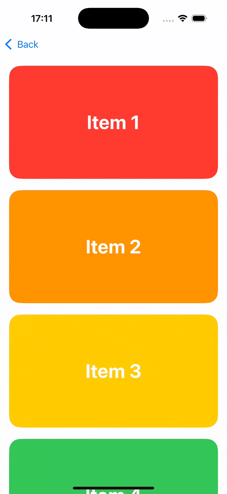
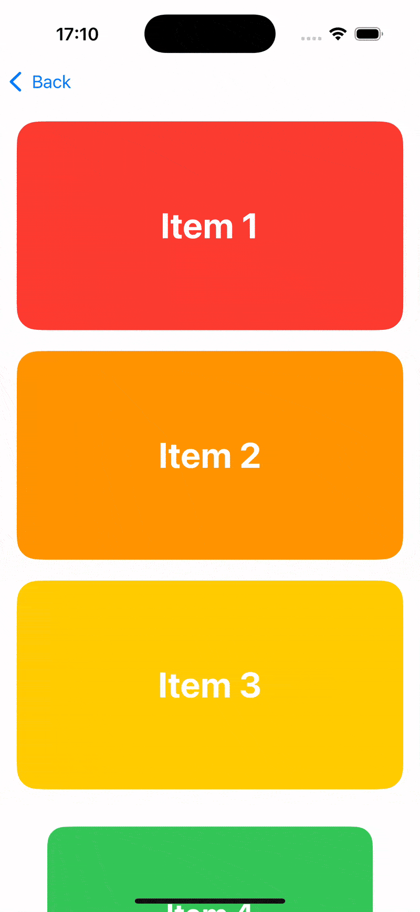
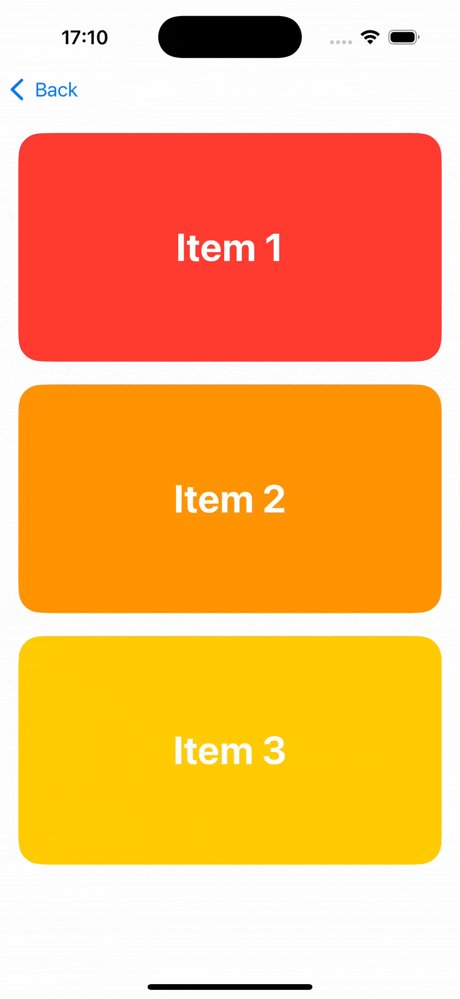

# iOS Learning

Collection of random iOS explorations and learnings.

## Animated Scroll Transitions

Gives a few examples of how view transtions can be applied to views in a scrollview.

  
  
  

