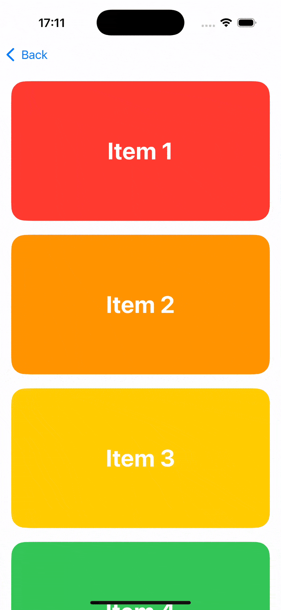
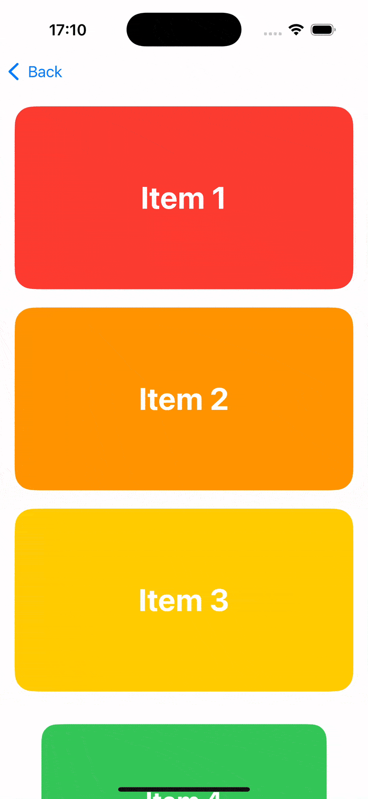
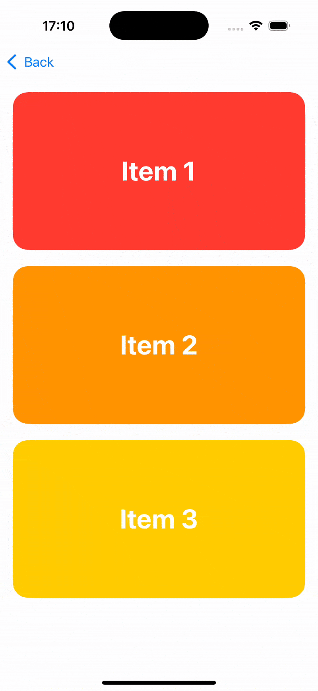
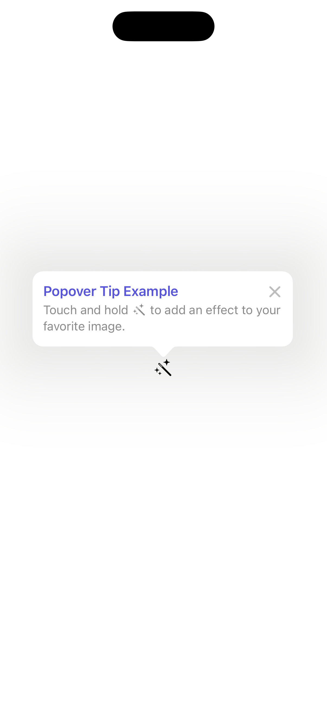
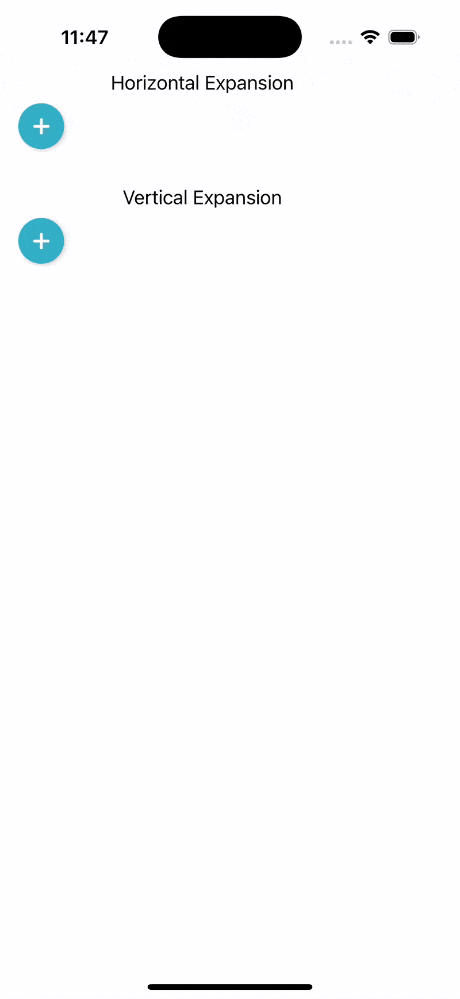
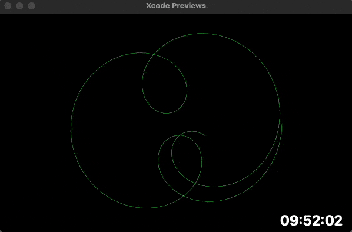

# iOS Learning

Collection of random iOS explorations and learnings.

## Animated Scroll Transitions

Gives a few examples of how view transtions can be applied to views in a scrollview.

|  |  |  |
| ------------------------------------------------------ | --------------------------------------------------------------------- | --------------------------------------------------------------------------- |

## TipKit

|  |  |  |  |
|--------------|--------------|---------------|------------|

## ViewTransitions

||
|------------------------------------------------|

## Pi Day

Explores rotating animations based on Pi. Includes a screensave in SwiftUI

||
|------------------------------------------------|

## Interval Runner (Workout App)

A specialized interval training application for iOS and watchOS, focusing on HIIT sessions and HealthKit integration.

### Key Learnings
* **HealthKit:** Implementing `HKWorkoutSession` and `HKLiveWorkoutBuilder` to ensure background activity and accurate data collection on watchOS.
* **Swift Charts:** Creating dynamic, interactive heart rate visualizations to track intensity throughout a workout session.
* **WatchConnectivity:** Synchronizing custom workout templates between the iPhone and Apple Watch seamlessly.
* **Haptic Design:** Using `WKHapticType` to provide non-visual cues for interval transitions.
