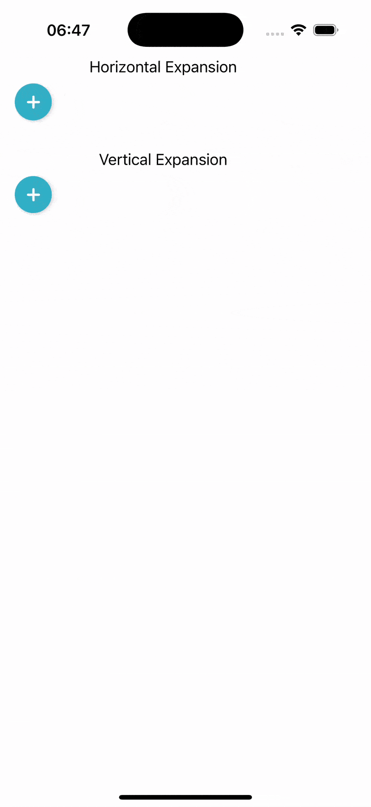

# iOS Learning

Collection of random iOS explorations and learnings.

## Animated Scroll Transitions

Gives a few examples of how view transtions can be applied to views in a scrollview.

|  |  |  |
| ------------------------------------------------------ | --------------------------------------------------------------------- | --------------------------------------------------------------------------- |

## TipKit

|  |  |  |  |
|--------------|--------------|---------------|------------|

## ViewTransitions

||
|------------------------------------------------|

## Pi Day

Explores rotating animations based on Pi. Includes a screensave in SwiftUI

||
|------------------------------------------------|
